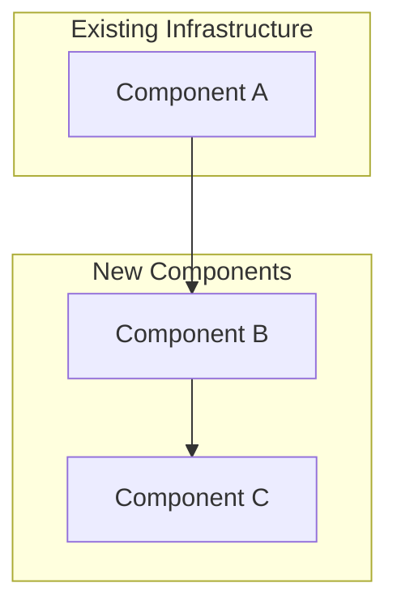
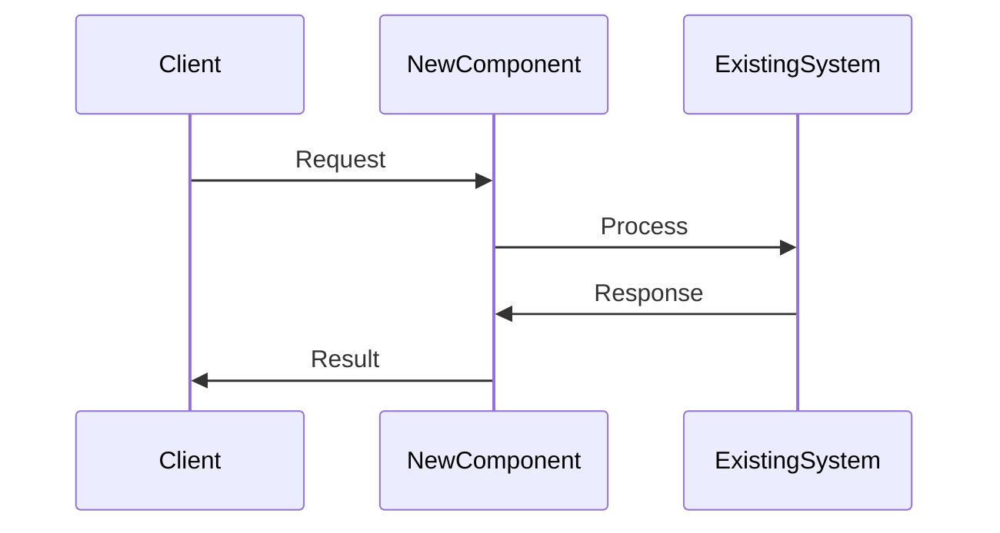

# {{FEATURE_NAME}} Design

## Overview

{{Brief description of the design approach and key decisions.}}

## Architecture

### High-Level Architecture



### Component Integration



## Components and Interfaces

### 1. {{Component Name}}

**File**: `{{file_path}}`

{{Description of component purpose and responsibilities.}}

```python
class {{ClassName}}:
    def __init__(self, config: {{ConfigType}})
    def {{method_name}}(self, params: {{ParamType}}) -> {{ReturnType}}
```

**Key Features**:
- {{Feature 1}}
- {{Feature 2}}

### 2. {{Component Name}}

**File**: `{{file_path}}`

{{Description}}

## Data Models

### Request Models

```python
@dataclass
class {{RequestModel}}:
    """{{Description}}"""
    {{field_name}}: {{type}}  # {{description}}
    {{field_name}}: Optional[{{type}}] = None  # {{description}}
```

### Response Models

```python
@dataclass
class {{ResponseModel}}:
    """{{Description}}"""
    success: bool
    data: {{DataType}}

@dataclass
class {{DataModel}}:
    """{{Description}}"""
    {{field_name}}: {{type}}
```

## Correctness Properties

*Properties bridge requirements to testable behaviors. Each property should be implementable as a property-based test.*

**Property 1: {{Short name}}**
*For any* {{input/condition}}, {{the system should}} {{expected behavior}}
**Validates: Requirements {{X.Y}}**

**Property 2: {{Short name}}**
*For any* {{input/condition}}, {{the system should}} {{expected behavior}}
**Validates: Requirements {{X.Y, Z.W}}**

<!--
PROPERTY GUIDELINES:
- Start with "For any" to indicate property-based testing
- Link to specific requirement acceptance criteria
- Make properties testable and unambiguous
- Consolidate similar properties to avoid redundancy
-->

## Error Handling

### Error Response Format

```python
{
    "success": False,
    "error": {
        "code": "{{ERROR_CODE}}",
        "message": "{{Human readable message}}",
        "details": {...}
    },
    "isError": True
}
```

### Error Categories

1. **Validation Errors** (`VALIDATION_ERROR`)
   - {{Error case 1}}
   - {{Error case 2}}

2. **Not Found Errors** (`NOT_FOUND`)
   - {{Error case}}

3. **Internal Errors** (`INTERNAL_ERROR`)
   - {{Error case}}

## Testing Strategy

### Unit Testing
- {{What to test}}
- {{What to mock}}

### Property-Based Testing
- Use Hypothesis library
- Minimum 100 iterations per property
- Tag tests with property references

### Integration Testing
- {{Integration test approach}}

## Infrastructure Integration

### Deployment
{{Describe deployment approach - new Lambda, extend existing, etc.}}

### Configuration
{{Describe configuration needs - SSM parameters, environment variables, etc.}}

### Monitoring
{{Describe logging and metrics}}

## Revision History

- {{YYYY-MM-DD}}: Initial design document created
